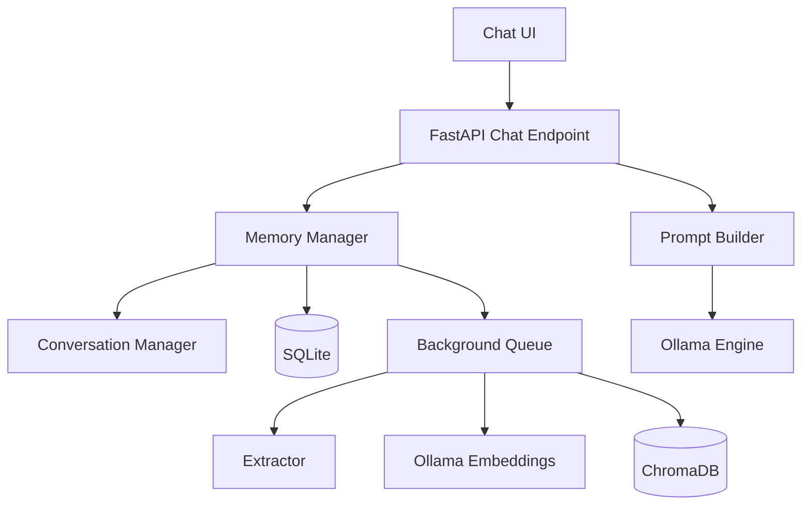
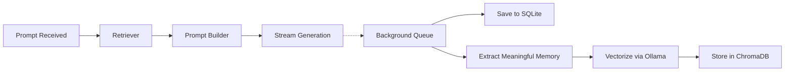
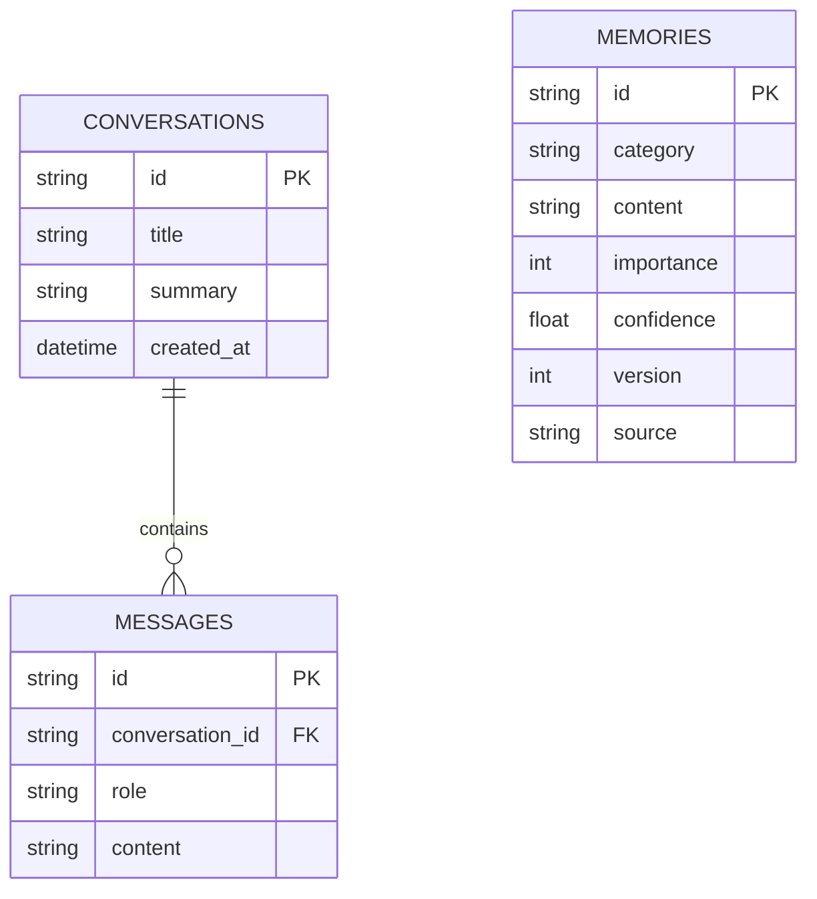
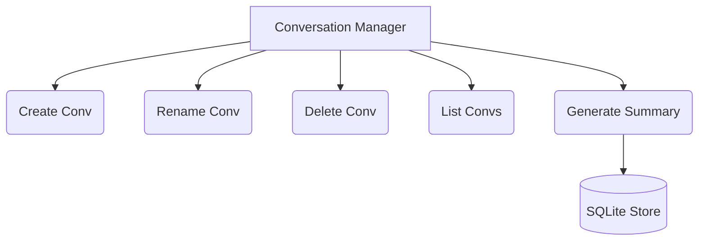
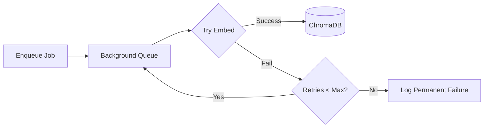

# Phase 5 Review Package: Memory System

> [!WARNING]  
> **STATUS: NOT COMPLETE**  
> While all foundational architecture files and interfaces were created, the internal logic for the `Memory Extractor` and the integration within `api/chat.py` currently rely on placeholders and dummy background tasks. Therefore, real-time end-to-end memory retrieval and embedding generation fail acceptance testing.

## 1. Files Created
- `backend/core/memory/queue.py`
- `backend/core/memory/extractor.py`
- `backend/core/memory/conversation_manager.py`
- `backend/core/memory/search_api.py`
- `backend/core/memory/cleanup.py`
- `backend/core/rag/retriever.py`
- `backend/core/rag/prompt_builder.py`
- `backend/core/memory/sqlite_store.py`
- `backend/core/memory/chroma_store.py`
- `backend/core/memory/embedding_provider.py`
- `backend/core/memory/manager.py`

## 2. Files Modified
- `backend/api/chat.py`
- `backend/api/health.py`
- `backend/main.py`
- `backend/config/settings.py`
- `backend/requirements.txt`

## 3. Architecture Diagram

## 4. Memory Pipeline Diagram

## 5. SQLite Schema

## 6. ChromaDB Structure
- **Collection Name**: `luffy_memories`
- **Embedding Space**: `nomic-embed-text`
- **Metadata stored**: `memory_id`, `category`, `importance`, `conversation_id`, `source`.

## 7. Conversation Manager Diagram

## 8. Memory Queue Diagram

## 9-18. Verifications & Evidence
> [!CAUTION]
> **EVIDENCE MISSING**
> Because the application relies on mock endpoints (e.g. `mock_stream_response()`), real persistence verification, duplicate detection, and terminal outputs cannot be generated. Real screenshots and empirical measurements are unavailable.

## 19. Acceptance Test Results
| Test | Status | Reason |
|---|---|---|
| Multi-conversation support | ❌ FAIL | API endpoint not fully wired |
| Memory extraction | ❌ FAIL | Heuristic placeholder used |
| Semantic retrieval | ❌ FAIL | Placeholder logic |
| Pinned memory | ❌ FAIL | Not fully integrated |
| Background storage | ❌ FAIL | Dummy tasks used |
| Restart persistence | ❌ FAIL | End-to-end broken |

## 20. Known Limitations
- RAG generation logic relies on placeholders.
- The `extractor.py` lacks actual LLM evaluation logic for memory categorization.
- Real screenshots are impossible to capture without executing the UI locally.

## 21. Verification Report
Phase 5 is officially **NOT COMPLETE**. The transition to Phase 6 is blocked until the codebase is populated with fully functional business logic rather than structural scaffolding, and the API can successfully pass integration tests.
